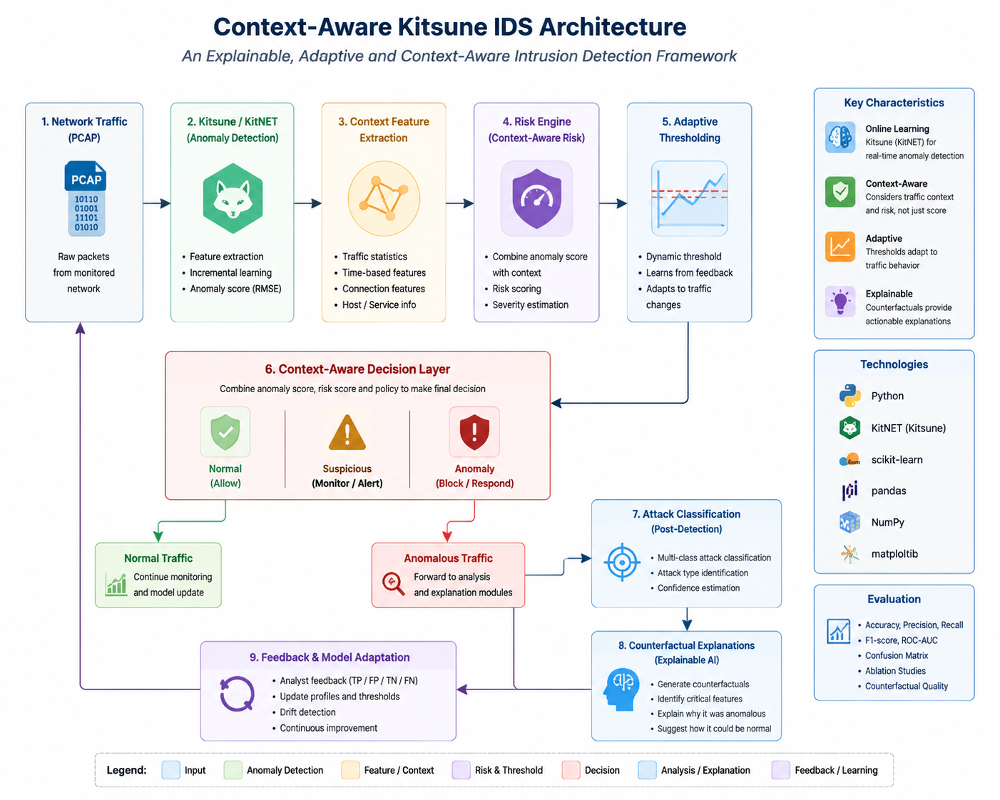

# Context-Aware Kitsune IDS

Context-Aware Kitsune IDS is a research implementation of an intrusion detection pipeline that extends Kitsune-style online anomaly detection with contextual risk assessment, adaptive decision thresholds, attack classification, and actionable counterfactual explanations.

The project integrates anomaly detection, contextual analysis, adaptive decision making, and explainable AI techniques to improve the interpretability and operational relevance of network intrusion detection systems.

---

# Research Motivation

Traditional network intrusion detection systems often rely on anomaly scores or classification labels alone. However, an anomaly score does not always represent the real operational risk of a network event.

The same anomaly score may require different responses depending on:

- Traffic behaviour and context.
- Historical network profiles.
- Risk level of the detected event.
- Cost of false positives and false negatives.

This project investigates a context-aware IDS pipeline that transforms raw anomaly signals into explainable and policy-aware security decisions.

---

# Architecture Overview

```text
                    Network Traffic (PCAP)
                              |
                              v
                Kitsune / KitNET Feature Extraction
                              |
                              v
                    Online Anomaly Detection
                              |
                              v
              Context Feature Extraction + Profiling
                              |
                              v
                         Risk Engine
                              |
                              v
                    Adaptive Thresholding
                              |
                              v
                  Context-Aware Decision Layer
                              |
              +---------------+---------------+
              |                               |
              v                               v
      Normal Traffic                  Attack Classification
                                              |
                                              v
                              Counterfactual Explanations
```

The system follows a multi-stage decision process:

1. Network traffic is processed through Kitsune-style online anomaly detection.
2. Contextual features and behavioural profiles are extracted.
3. Risk assessment adjusts the interpretation of anomaly scores.
4. Adaptive thresholds improve detection under changing traffic conditions.
5. The decision layer determines the final security action.
6. Explanation modules generate interpretable reasons for detected events.

---

# Features

## Anomaly Detection

- Kitsune-based online anomaly detection using KitNET.
- Streaming network traffic analysis.
- Feature-based anomaly scoring.

## Context-Aware Risk Assessment

- Context feature extraction.
- Traffic behaviour profiling.
- Risk-aware decision making.

## Adaptive Decision System

- Dynamic threshold adjustment.
- Feedback-aware calibration.
- Reduction of unnecessary false alarms.

## Attack Analysis

- Attack classification after anomaly detection.
- Security event categorization.
- Risk-based prioritization.

## Explainable AI

- Counterfactual explanations for IDS decisions.
- Identification of feature changes affecting decisions.
- Research framework for explainable intrusion detection.

---

# Repository Structure

```
Context-Aware-Kitsune-IDS/

│
├── KitNET/
│   └── KitNET implementation
│
├── counterfactual_engine/
│   └── Counterfactual explanation methods
│
├── decision_layer/
│   └── Security decision and response policies
│
├── evaluation/
│   └── Evaluation pipelines and metrics
│
├── experiments/
│   └── Research experiments and analysis scripts
│
├── feedback/
│   └── Feedback and adaptive learning components
│
├── profiles/
│   └── Network behaviour profiles
│
├── paper/
│   └── Research paper sources and figures
│
├── main_ids.py
│   └── Main IDS execution pipeline
│
├── kitsune_wrapper.py
│   └── Kitsune integration interface
│
├── feature_extractor.py
│   └── Network feature extraction
│
├── adaptive_threshold.py
│   └── Adaptive threshold mechanism
│
├── context_features.py
│   └── Context feature generation
│
├── risk_engine.py
│   └── Context-aware risk scoring
│
├── attack_classifier.py
│   └── Attack classification module
│
├── explain_pipeline.py
│   └── Explanation generation pipeline
│
├── requirements.txt
│   └── Python dependencies
│
└── README.md
```

---

# Installation

## Requirements

- Python 3.10 or newer
- pip package manager

Clone the repository:

```bash
git clone https://github.com/benjari2004-hash/Context-Aware-Kitsune-IDS.git

cd Context-Aware-Kitsune-IDS
```

Create a virtual environment:

```bash
python -m venv .venv
```

---

## Windows PowerShell

Activate environment:

```powershell
.\.venv\Scripts\Activate.ps1
```

Install dependencies:

```powershell
pip install -r requirements.txt
```

---

## macOS/Linux

Activate environment:

```bash
source .venv/bin/activate
```

Install dependencies:

```bash
pip install -r requirements.txt
```

---

# Usage

## Run IDS on Packet Capture

Example:

```bash
python main_ids.py --pcap /path/to/capture.pcap --mode NORMAL
```

Available operation modes:

```
NORMAL
SENSITIVE
STRICT
```

View all options:

```bash
python main_ids.py --help
```

---

# Evaluation

The project provides an evaluation framework for testing detection performance.

Supported evaluation tasks include:

- Dataset preprocessing.
- Detection metrics calculation.
- Baseline comparison.
- Experiment logging.
- Counterfactual explanation evaluation.

Example:

```bash
python evaluation/run_unsw_experiment.py \
--csv /path/to/UNSW_NB15_training-set.csv \
--results evaluation/results
```

---

# Datasets

Raw datasets and packet captures are intentionally not included in this repository.

Supported datasets include:

- UNSW-NB15
- Network packet captures (PCAP)

Users should download datasets from their official sources and provide local paths during execution.

Dataset files are excluded from Git tracking to keep the repository lightweight and reproducible.

---

# Experimental Framework

The experiment framework supports research analysis including:

- False-positive injection experiments.
- Threshold adaptation studies.
- Feedback-based learning experiments.
- Drift analysis.
- Ablation studies.
- Counterfactual explanation quality evaluation.

Generated files such as:

- CSV results.
- Logs.
- Figures.
- Packet captures.

are generated locally and excluded from version control.

---

# Research Contributions

This project explores the combination of:

- Online anomaly detection.
- Context-aware security analysis.
- Adaptive decision mechanisms.
- Explainable AI for intrusion detection.

The main research objective is improving the connection between anomaly detection output and actionable security decisions.

---

# Research Use

This repository is intended for:

- Academic research.
- Experimental evaluation.
- IDS algorithm development.

Configurations, thresholds, and security policies should be validated in controlled environments before deployment in operational networks.

---

# Citation

If you use this project in academic research, please cite:

```bibtex
@software{benjari2026contextawarekitsune,
  author = {Mohamed Benjari},
  title = {Context-Aware Kitsune IDS},
  year = {2026},
  url = {https://github.com/benjari2004-hash/Context-Aware-Kitsune-IDS}
}
```

---

# License

This project is released under the MIT License.

See the LICENSE file for details.
